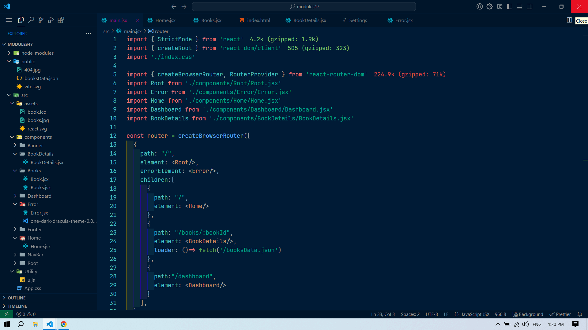
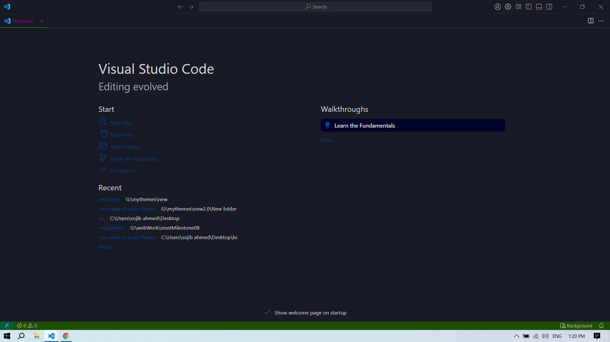

# One Dark Night theme

One Dark Night Theme optimized for comfortable long coding hours.Focused dark navy palette for reduced eye strain while coding.

>
> ## Thanks for checking out my VS Code theme.
> ## Themes Included
> 
> * One Dark Night - Minimalist
> * One Dark Night - Official
> * One Dark Night - Peace of the eye
> * One Dark Night - Professional
> * One Dark Night - React Coder
>

__________________________________

## demo themes

__________________________________
- One Dark Night - Official

__________________________________
- One Dark Night - Peace of the eye

__________________________________
- One Dark Night - Professional

__________________________________
- One Dark Night - React Coder

__________________________________

__________________________________
- One Dark Night - Minimalist

__________________________________

> ## Installation
> - [x] Open the extensions sidebar on Visual Studio Code
> - [x] Search for Midnight Navy 
> - [x] Click Install
> - [x] Select the Manage Cog (bottom left) > Color Theme ＞ One Dark Night
> - linux: `Ctrl + Shift + P `
> - macOS: `Cmd + Shift + P `
> - windows: `Ctrl + Shift + P ` 
Type theme, choose Preferences: Color Theme, and select One Dark Night from the list. After activation, the theme will be activated.
> - [x] Click Reload to reload your editor
🌟🌟🌟🌟🌟 Rate five-stars 😃

**Enjoy!**
